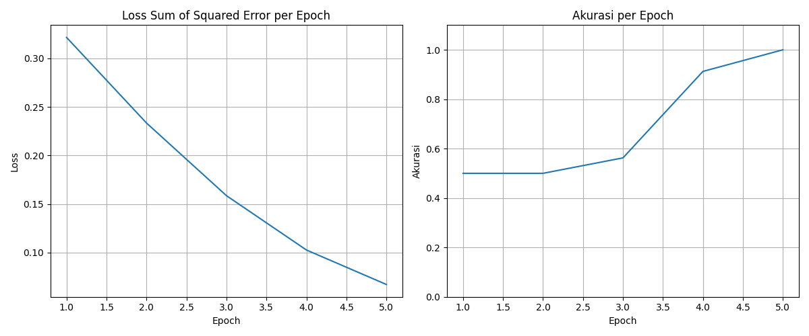

# Tugas - Single Layer Perceptron with Sigmoid Activation for Binary Classification on Iris Dataset

Proyek ini adalah implementasi dari _Single Layer Perceptron_ dengan fungsi aktivasi sigmoid untuk melakukan klasifikasi biner pada Iris dataset.

# Tugas Simgle Layer Perceptron Kelas Pembelajaran Mesin Mendalam KOM A 2025

## 👨‍💻 Anggota Kelompok

- **Andrian Danar Perdana** (23/513040/PA/21917)
- **Andreandhiki Riyanta Putra** (23/517511/PA/22191)
- **Daffa Indra Wibowo** (23/518514/PA/22253)
- **Muhammad Argya Vityasy** (23/522547/PA/22475)
- **Rayhan Firdaus Ardian** (23/519095/PA/22279)

## 🚀 Cara Menjalankan Kode

1. Pastikan semua _library_ yang dibutuhkan sudah ter-install:

    ```bash
    pip install -r requirements.txt
    ```

2. Jalankan file `perceptron.py` menggunakan Python:

    ```bash
    python perceptron.py
    ```

3. Skrip akan melatih model, melakukan evaluasi, dan menampilkan hasil akurasi pada _console_. Selain itu, dua buah grafik (`loss_per_epoch.png` dan `accuracy_per_epoch.png`) akan disimpan di direktori yang sama.

## 📊 Hasil

Setelah melatih model selama **200 epoch** dengan _learning rate_ **0.1**, didapatkan hasil sebagai berikut:

- **Akurasi training terakhir**: 1.0000
- **Akurasi testing**: 1.0000

### Grafik Pelatihan

Berikut adalah grafik _loss_ dan akurasi selama proses pelatihan.





